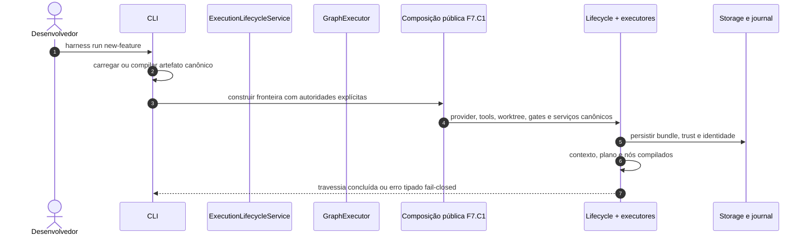
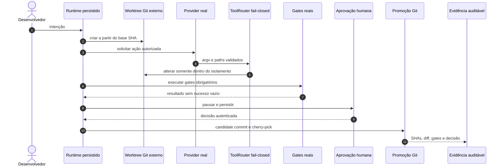

# Modelo Operacional Agentic — Estado Atual e Arquitetura-Alvo

> **Status: MVP operacional / Release candidate 0.2.0rc1**

Este documento separa o fluxo que o código executa hoje do fluxo que o produto deverá garantir. A
presença de uma classe, estado da FSM ou teste unitário não significa que a integração externa ou o
efeito operacional correspondente já exista.

## Fluxo observado no comando padrão

Para `new-feature`, a CLI seleciona `build_new_feature_lifecycle` e compõe providers OpenAI/local,
tool loop durável, worktree externo, terminal, edição, candidate commit, verificação, aprovação,
cherry-pick, knowledge, evidence e rollback Git. A F7.C1 comprovou essa fronteira pela wheel instalada
em repositório externo descartável, usando adapter HTTP de produção contra transporte controlado.
Autoridade de promoção, credencial, trust, policy ou grant ausente continua bloqueando antes do efeito.
Workflows sem composição registrada recebem um lifecycle fail-closed com registry vazio; não há
fallback genérico nem sucesso simulado.

## Fluxo-alvo

## Contratos que já possuem base

- empacotamento e ambiente de desenvolvimento reproduzíveis;
- contratos Pydantic, defaults e versionamento de schemas;
- FSM e arquivos locais de contexto, plano, estado e evidência;
- `ExternalWorktreeManager` com `git worktree` real, referência durável e path guard canônico;
- execução de subprocessos de verificação por `argv`, com executável autorizado, cwd confinado,
  ambiente seletivo, timeout da árvore de processos e saída limitada/redigida;
- edição local real por leitura, listagem, busca e patch atômico confinados, além de cliente Serena MCP
  explícito com prova de raiz, capability e mudança;
- factory opt-in para registrar oito tools operacionais sem relaxar a policy compilada ou deny-wins;
- journal, evidence e hash chain locais com validação fail-closed;
- `doctor` read-only que verifica sete componentes e retorna estado tipado/exit code não zero quando
  unhealthy;
- candidate commit, promoção por `git cherry-pick` e rollback por `git revert` como efeitos Git reais;
- composição pública canônica desses contratos para o workflow `new-feature`, sem factory de fixture.

## Lacunas que impedem uso seguro

- providers OpenAI/local fazem chamadas reais quando configurados; serviço, endpoint e credencial
  continuam pré-requisitos explícitos e verificados;
- Serena possui cliente MCP explícito e opt-in; Codebase-Memory ainda não oferece memória real;
- `doctor` mede configuração e saúde local sem efeitos, mas providers/MCP live continuam dependentes de
  credenciais, configuração e serviços externos;
- somente `new-feature` possui composição pública; `bug-fix`, `refactoring`, `migration` e `incident`
  continuam fail-closed sem executores operacionais;
- Serena permanece MCP opcional e Codebase-Memory não oferece backend externo de memória;
- promoção exige autorização externa e decisão humana ligada ao conteúdo; nenhuma flag ou resposta de
  modelo fabrica essa autoridade;
- rollback valida o `git revert`, mas não reexecuta automaticamente os gates pós-reversão;
- journal e evidence são tamper-evident locais, sem âncora externa imutável.

O plano concreto para fechar essas lacunas está em
[plano_implementacao_harness_operacional.md](plano_implementacao_harness_operacional.md), e a ordem
obrigatória da composição está na
[DEC-016](decisions/DEC-016-composicao-operacional-antes-da-release.md).
