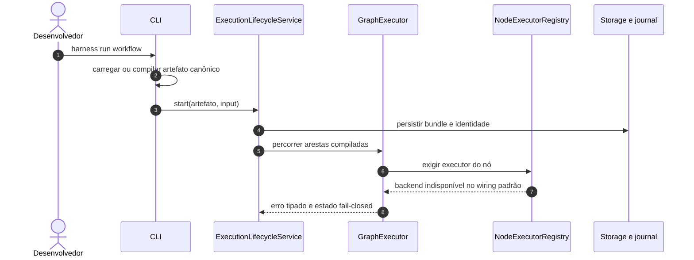
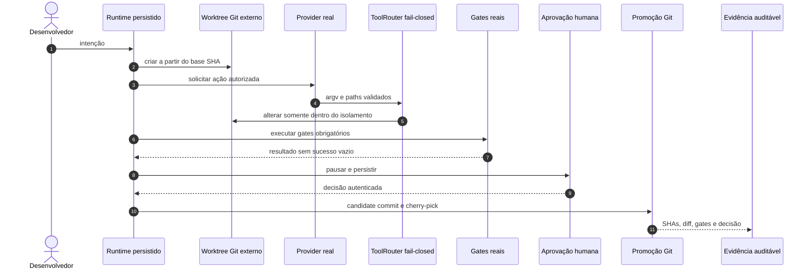

# Modelo Operacional Agentic — Estado Atual e Arquitetura-Alvo

> **Status: Protótipo / Em desenvolvimento**

Este documento separa o fluxo que o código executa hoje do fluxo que o produto deverá garantir. A
presença de uma classe, estado da FSM ou teste unitário não significa que a integração externa ou o
efeito operacional correspondente já exista.

## Fluxo observado no comando padrão

O comando padrão não fabrica resposta de modelo nem declara promoção: ele constrói o lifecycle com um
registry de executores deliberadamente vazio e falha antes de efeitos operacionais. Quando injetados
explicitamente, providers OpenAI/local, tool loop durável, worktree, terminal, edição, candidate
commit, aprovação, cherry-pick, evidence e rollback Git usam primitivas reais testadas; a F7.1
comprovou essa composição apenas em fixture controlada. A CLI ainda não constrói essa fronteira
automaticamente; a DEC-016 reservou essa integração para F7.C1, depois da portabilidade F7.4 e antes
da release candidate F7.5.

## Fluxo-alvo

## Contratos que já possuem base

- empacotamento e ambiente de desenvolvimento reproduzíveis;
- contratos Pydantic, defaults e versionamento de schemas;
- FSM e arquivos locais de contexto, plano, estado e evidência;
- `ExternalWorktreeManager` com `git worktree` real, referência durável e path guard canônico;
- execução de subprocessos de verificação por `argv`, com executável autorizado, cwd confinado,
  ambiente seletivo, timeout da árvore de processos e saída limitada/redigida;
- edição local real por leitura, listagem, busca e patch atômico confinados, além de cliente Serena MCP
  explícito com prova de raiz, capability e mudança;
- factory opt-in para registrar oito tools operacionais sem relaxar a policy compilada ou deny-wins;
- journal, evidence e hash chain locais com validação fail-closed;
- `doctor` read-only que verifica sete componentes e retorna estado tipado/exit code não zero quando
  unhealthy;
- candidate commit, promoção por `git cherry-pick` e rollback por `git revert` como primitivas Git
  reais, ainda dependentes de injeção explícita.

## Lacunas que impedem uso seguro

- providers OpenAI/local fazem chamadas reais quando configurados, mas nenhum backend agentic padrão
  fecha sozinho o fluxo do produto;
- Serena possui cliente MCP explícito e opt-in; Codebase-Memory ainda não oferece memória real;
- `doctor` mede configuração e saúde local sem efeitos, mas providers/MCP live continuam dependentes de
  credenciais, configuração e serviços externos;
- o worktree Git real ainda não está ligado automaticamente ao lifecycle e ao registry opt-in;
- promoção e rollback possuem protocolos Git reais quando injetados, mas não são acionados pela CLI
  padrão;
- terminal, edição local, Git somente leitura e Serena possuem registrations opt-in, mas o lifecycle
  ainda não constrói esse registry nem injeta o worktree provisionado;
- persistência, budgets, secrets e políticas controlam suas primitivas, mas ainda não cobrem uma
  composição automática de todo o caminho crítico.

O plano concreto para fechar essas lacunas está em
[plano_implementacao_harness_operacional.md](plano_implementacao_harness_operacional.md), e a ordem
obrigatória da composição está na
[DEC-016](decisions/DEC-016-composicao-operacional-antes-da-release.md).
