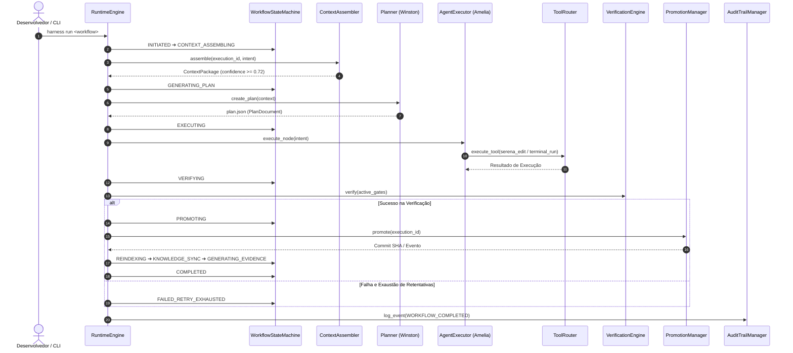

# Modelo Operacional Agentic — Narrative & Architecture

O **AI-Engineering-Harness** é a infraestrutura de engenharia local-first projetada para sustentar o ciclo autônomo de desenvolvimento de software governado por IA.

---

## 🚀 Fluxo de Execução do Ciclo Agentic

---

## 🛠️ Princípios Fundamentais

1. **Local-First & Instalável:** O pacote `ai-engineering-harness` é totalmente instalável via `pip install -e .` e inicializável em qualquer repositório de produto via `harness init`.
2. **Separação Rígida Agente/Ferramenta:**
   - **Agente (Persona):** Raciocínio, tomada de decisão e invocação de habilidades (ex: Winston, Amelia).
   - **ToolRouter:** Guardião de segurança e permissões para execução de chamadas MCP/terminal.
3. **Audit Trail Tamper-Evident:** Registro append-only encadeado por SHA-256 no diário de eventos.
