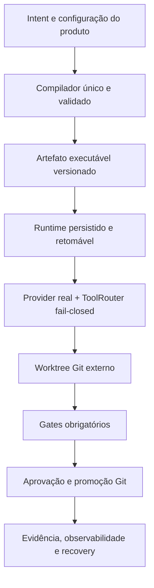

# Especificação Arquitetural — AI Engineering Harness

> **Status: Arquitetura-alvo / Em desenvolvimento**
> **Revisão documental:** 1.0.0 — não confundir com package ou schema version

## 1. Visão do produto

O produto pretende ser uma infraestrutura local-first instalável por CLI ou IDE. Um repositório
externo deverá receber configuração leve em `.harness/`, enquanto execução, ferramentas, Git,
políticas e evidências permanecerão controlados pelo motor instalado.

No estado atual, essa visão está parcialmente materializada como harness de testes, contratos e
primitivas operacionais reais. O isolamento por worktree, terminal e edição existe de forma injetável,
mas o produto ainda não os compõe automaticamente no lifecycle e não oferece autonomia suficiente
para uso cotidiano sem supervisão.

## 2. Arquitetura-alvo

## 3. Mapeamento atual

| Camada | Base existente | Estado | Limite principal |
|---|---|---|---|
| Package e defaults | `pyproject.toml`, `uv.lock`, `src/ai_engineering_harness/defaults/` | Implementada como base | Distribuição de produto e compatibilidade externa ainda não fechadas |
| Contratos | `src/ai_engineering_harness/contracts/` | Implementada como modelos internos | Evolução/migração compatível dos schemas ainda não está fechada |
| Compilação | `src/ai_engineering_harness/compiler/` com wrapper legado em `compiler/` | Implementada como pipeline canônico | Distribuição e migração externa dos contratos ainda não estão fechadas |
| Runtime | `src/ai_engineering_harness/runtime/` | Implementado como núcleo injetável | Percorre arestas, persiste e retoma; o wiring padrão não fornece executores/tools operacionais nem compõe promoção automaticamente |
| Ferramentas/modelos | `tools/`, `models/`, `indexer/` | Primitivas reais/injetáveis | Edição confinada, terminal, Git somente leitura, providers e memória estrutural local possuem testes e registry opt-in; integração automática e backends externos de memória ainda faltam |
| Verificação | `verification/`, `tests/ci/` | Implementada para os gates do próprio projeto | CI executa quality/tests/package em Windows e Linux, cobertura decisória, scan de secrets e auditoria de dependências; a composição dos gates no lifecycle padrão continua injetável |
| Governança/segurança | `governance/`, `security/` | Implementada como fronteiras injetáveis | Policy default-deny, trust, orçamento e redaction governam primitivas reais; o wiring padrão ainda não cobre todo side effect do produto |
| Auditoria | `observability/audit.py`, `observability/evidence.py` | Implementada como evidência local fail-closed | Journal/evidence validam identidade e digest; hash chain local não é âncora externa imutável e a composição pública ainda falta |
| Workspace Git | `workspace/` | Implementada como primitivo | Cria/valida worktree Git externo e guard canônico; integração automática com lifecycle/tools ainda falta |

## 4. Separação Harness vs. produto

- **Motor instalado:** código sob `src/ai_engineering_harness/`, contratos, defaults e CLI.
- **Configuração do produto:** `.harness/agents/`, `.harness/graphs/specs/`,
  `.harness/policies/` e `.harness/tools/`.
- **Estado local:** `.harness/state/` e `.harness/artifacts/`.
- **Isolamento disponível como primitivo:** worktree Git externo associado a `execution_id`; uma
  factory opt-in aceita seu guard explicitamente, mas a injeção pelo lifecycle continua pendente.

`harness init` cria/copia a estrutura local, mas isso não torna o repositório governado ou seguro por
si só.

## 5. Invariantes do contrato final

- nenhuma escrita fora do worktree autorizado;
- comandos como `argv: list[str]`, `shell=False`;
- gate obrigatório ausente ou não executado termina em erro;
- adapters indisponíveis falham com erro tipado;
- dry-run não usa semântica de promoção concluída;
- aprovação, orçamento e política controlam side effects;
- secrets são redigidos antes da persistência;
- estado necessário para retomar sobrevive a crash;
- promoção e rollback usam operações Git explícitas com SHAs reais.

Essas invariantes são requisitos do plano. Enquanto qualquer uma não estiver garantida no caminho
crítico, o projeto permanece protótipo. A DEC-016 exige a composição pública na F7.C1 antes da
release candidate F7.5.
