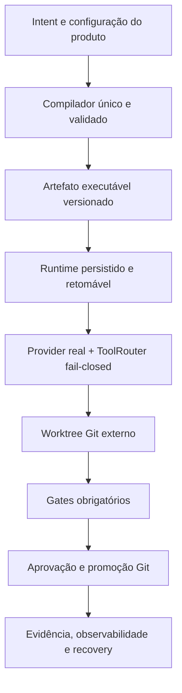

# Especificação Arquitetural — AI Engineering Harness

> **Status: MVP operacional / Release candidate 0.2.0rc1**
> **Revisão documental:** 1.0.0 — não confundir com package ou schema version

## 1. Visão do produto

O produto é uma infraestrutura local-first instalável por CLI. Um repositório
externo recebe configuração leve em `.harness/`, enquanto execução, ferramentas, Git,
políticas e evidências permanecerão controlados pelo motor instalado.

No estado atual, o workflow público `new-feature` compõe essas primitivas operacionais no lifecycle:
provider configurado, worktree, tools, gates, aprovação, promoção, knowledge, evidence e rollback.
Os demais workflows permanecem fail-closed, a interface IDE está fora da RC e nenhuma integração live
ou autoridade humana é presumida.

## 2. Arquitetura-alvo

## 3. Mapeamento atual

| Camada | Base existente | Estado | Limite principal |
|---|---|---|---|
| Package e defaults | `pyproject.toml`, `uv.lock`, `src/ai_engineering_harness/defaults/` | RC `0.2.0rc1` | Prerelease distribuída no GitHub, sem publicação no PyPI ou garantia estável |
| Contratos | `src/ai_engineering_harness/contracts/` | Implementada como modelos internos | Evolução/migração compatível dos schemas ainda não está fechada |
| Compilação | `src/ai_engineering_harness/compiler/` com wrapper legado em `compiler/` | Implementada como pipeline canônico | Distribuição e migração externa dos contratos ainda não estão fechadas |
| Runtime | `src/ai_engineering_harness/runtime/` | Implementado e composto em `new-feature` | Percorre arestas, persiste/retoma e mantém demais workflows sem composição em fail-closed |
| Ferramentas/modelos | `tools/`, `models/`, `indexer/` | Efeitos reais; composição pública F7.C1 | Edição confinada, terminal, Git somente leitura, providers e memória local; serviços live e Serena são opt-in |
| Verificação | `verification/`, `tests/ci/` | Implementada e composta em `new-feature` | CI certifica Windows/Linux; stack e ferramentas do repositório externo continuam pré-requisitos |
| Governança/segurança | `governance/`, `security/` | Implementada no caminho público | Policy default-deny, trust, orçamento e redaction governam os efeitos; autorização externa continua obrigatória |
| Auditoria | `observability/audit.py`, `observability/evidence.py` | Evidência local fail-closed no caminho público | Journal/evidence validam identidade e digest; hash chain local não é âncora externa imutável |
| Workspace Git | `workspace/` | Implementado e composto em `new-feature` | Worktree externo e guard canônico; rollback não reexecuta gates pós-reversão automaticamente |

## 4. Separação Harness vs. produto

- **Motor instalado:** código sob `src/ai_engineering_harness/`, contratos, defaults e CLI.
- **Configuração do produto:** `.harness/agents/`, `.harness/graphs/specs/`,
  `.harness/policies/` e `.harness/tools/`.
- **Estado local:** `.harness/state/` e `.harness/artifacts/`.
- **Isolamento do caminho público:** `new-feature` cria/recarrega o worktree Git externo associado ao
  `execution_id` e injeta o mesmo guard no lifecycle e nas tools.

`harness init` cria/copia a estrutura local, mas isso não torna o repositório governado ou seguro por
si só.

## 5. Invariantes do contrato final

- nenhuma escrita fora do worktree autorizado;
- comandos como `argv: list[str]`, `shell=False`;
- gate obrigatório ausente ou não executado termina em erro;
- adapters indisponíveis falham com erro tipado;
- dry-run não usa semântica de promoção concluída;
- aprovação, orçamento e política controlam side effects;
- secrets são redigidos antes da persistência;
- estado necessário para retomar sobrevive a crash;
- promoção e rollback usam operações Git explícitas com SHAs reais.

Essas invariantes são garantidas no caminho público `new-feature` e permanecem requisitos para cada
workflow futuro. A RC não é declaração de produção, autonomia geral ou compatibilidade estável; os
limites completos estão em [KNOWN_LIMITATIONS.md](../KNOWN_LIMITATIONS.md).
