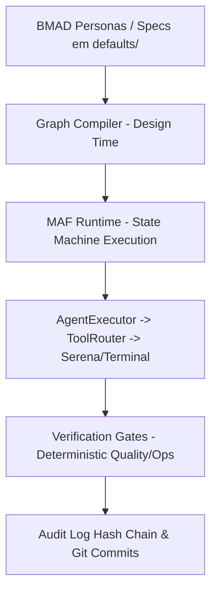

# Especificação Arquitetural — AI-Engineering-Harness

> **Status:** Congelada / Em Produção  
> **Versão:** 1.0.0  
> **Arquitetos Responsáveis:** 🏛️ Winston & 📝 Paige

---

## 1. Visão Geral do Sistema

O **AI-Engineering-Harness** é um motor agentic local-first, determinístico e instalável via Python (`pip install -e .`). Ele rege a execução de agentes de IA sobre qualquer repositório de software através de um ambiente isolado `.harness/`.

### A Equação do Harness
$$\text{Harness} = \text{BMAD} \longrightarrow \text{Graph Engineering} \longrightarrow \text{MAF} \longrightarrow \text{Serena + Codebase-Memory} \longrightarrow \text{Quality/Ops}$$

---

## 2. Componentes Fundamentais

### 2.1. Layer 1: Contracts, Defaults & Templates (`src/ai_engineering_harness/defaults/`)
- Contratos Pydantic imutáveis definem a validação estrita em `src/ai_engineering_harness/contracts/`.
- Especificações e templates declarativos em YAML para agentes, grafos, ferramentas e políticas residem em `src/ai_engineering_harness/defaults/`.

### 2.2. Layer 2: Design-Time Graph Compiler (`compiler/`)
- O Graph Compiler (`compiler/compile.py`) valida a conformidade dos contratos, ferramentas e políticas em *design-time*.
- Injeta automaticamente *Verification Gates* poliglotas determinísticos antes de gerar o artefato executável MAF JSON em `.harness/state/compiled/`.

### 2.3. Layer 3: MAF Runtime & Agentes (`src/ai_engineering_harness/runtime/`)
- Executa o ciclo de vida de 11 estágios da FSM com `ContextAssembler`, `Planner` e `AgentExecutor`.
- `ToolRouter` garante o controle de permissões para chamadas MCP/terminal.
- Controla a aprovação em duas fases (`AWAITING_APPROVAL`) e a promoção (`PromotionManager`).

### 2.4. Layer 4: Ferramentas & Memória (`Serena MCP` & `Codebase-Memory MCP`)
- **Serena MCP:** Interface com a codebase para edições de código e manipulação precisa.
- **Codebase-Memory MCP:** Indexador semântico de código AST vinculado ao SHA do Git Commit atual.

### 2.5. Layer 5: Governança, Segurança e Observabilidade (`defaults/policies/` & `observability/`)
- Políticas rígidas de ferramentas (`tool_policy.yaml`) e suficiência de contexto (`context_sufficiency.yaml`).
- Auditoria com **Hash Chain** imutável encadeada por SHA-256 no diário `event-journal.jsonl`.

---

## 3. Separação de Responsabilidades (Harness vs Produto)

- **Motor Central (`src/ai_engineering_harness/`):** Código-fonte compilado e instalado do motor (runtime, compilador, defaults).
- **Workspace Local (`.harness/`):** Diretório gerado por `harness init` no repositório de destino:
  - `.harness/agents/`: Templates de personas e system prompts copiados de `defaults/`.
  - `.harness/graphs/specs/`: Grafos compiláveis.
  - `.harness/policies/`: Políticas ativas do repositório local.
  - `.harness/tools/`: Configurações locais de ferramentas.
  - `.harness/state/`: Estado FSM (`executions/`), indexador AST (`structural-index/`) e grafos compilados (`compiled/`).

---

## 4. Diagnóstico de Saúde e Probes (`harness doctor`)

O comando `harness doctor` executa um probe de 6 estágios sobre 4 componentes vitais:
1. **Serena MCP** (Status, conectividade, integridade de tools).
2. **Codebase-Memory MCP** (Conexão ao índice AST local).
3. **Git CLI** (Presença e permissões no workspace).
4. **LLM Providers** (Conectividade e API Keys).
