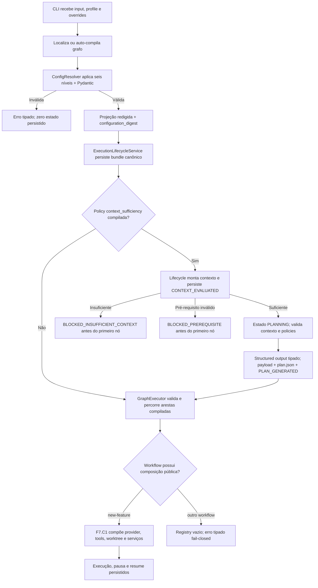

# Walkthrough da Estrutura e dos Fluxos Atuais

> **Status: mapa do MVP operacional / release candidate 0.2.0rc1 em 30 de agosto de 2026**

Este walkthrough mostra a organização real do repositório e distingue o que é código executável do
que é arquitetura futura. O [dashboard HTML](walkthrough_dashboard.html) é um artefato visual
histórico e não deve ser usado como fonte de status.

## Estrutura relevante

```text
ai-engineering-harness/
├── README.md
├── TASK.md
├── pyproject.toml
├── uv.lock
├── compiler/
│   ├── compile.py
│   └── validators/
├── docs/
├── src/ai_engineering_harness/
│   ├── cli/
│   ├── compiler/
│   ├── contracts/
│   ├── defaults/
│   │   ├── agents/
│   │   ├── graphs/
│   │   ├── policies/
│   │   └── tools/
│   ├── doctor/
│   ├── governance/
│   ├── indexer/
│   ├── models/
│   ├── observability/
│   ├── runtime/
│   ├── security/
│   ├── tools/
│   ├── verification/
│   └── workspace/
└── tests/
    ├── e2e/
    ├── fixtures/
    └── unit/
```

Não existem os diretórios autorais de raiz `contracts/` ou `policies/`. Os contratos e defaults
canônicos atuais ficam dentro do pacote. Especificações padrão de grafo ficam em
`src/ai_engineering_harness/defaults/graphs/`; `.harness/graphs/specs/` é criado no repositório
de destino por `harness init`.

## Fluxo de `harness init`

1. usa o diretório atual como raiz;
2. cria a árvore `.harness/`;
3. copia defaults de agents, graphs, policies e tools quando ainda não existem;
4. cria `.harness/project.yaml` com defaults Python/pytest.

Esse scaffold é um efeito real. Ainda faltam validação do repositório, migração transacional,
manifesto de versão e rollback de inicialização previstos na F7.

## Fluxo de `harness run`



Limitações importantes:

- defaults são lidos do pacote instalado por `importlib.resources`; `run --profile` seleciona o
  perfil e `--config-json` ocupa a maior precedência. `resume` usa somente a projeção redigida e o
  digest do bundle, sem adotar mudanças posteriores do disco;
- o runtime percorre nós/arestas pelo `GraphExecutor`; a CLI seleciona a composição pública F7.C1
  para `new-feature` e mantém registry vazio/fail-closed para workflows não registrados;
- os quatro workflows F4.3 exigem envelope exato `context_request + graph_input`; a decisão usa a
  policy resolvida do artefato, o snapshot do commit e os manifestos de conhecimento, com até duas
  retomadas além da tentativa inicial;
- a F4.4 promovida valida rota/egress, relê evidência por digest, exige plano tipado
  limitado às policies compiladas e persiste payload/projeção/eventos antes de entregar `graph_input`;
- a F4.5 promovida normaliza os IDs e bloqueia suítes vazias/desconhecidas/duplicadas; a F4.6
  promovida resolve configuração/argv e pré-requisitos no worktree antes de efeitos;
- providers e tools reais são compostos para `new-feature`; serviços live, credenciais e grants
  continuam explícitos e workflows adicionais não herdam essa autoridade;
- a F5.2 pré-autoriza cada lote por role/node/workflow/trust/tool/operação/path/aprovação, aplica
  default-deny e persiste a regra antes do efeito; o outcome fica ligado pelo digest da decisão;
- o `ToolRouter` operacional revalida a decisão e é construído pela factory pública `new-feature`;
- a trust boundary F5.3 e o budget F5.4 estão promovidos/reconciliados; a F5.6 promovida cria a aprovação
  de promoção somente após candidate + full suite e liga artifact/plano/diff/SHA/gates no mesmo
  `approval-request.json`;
- planejamento, nós/modelos, tools e verificação compartilham o ledger F5.4 persistido; excesso leva
  a `FAILED_BUDGET_EXCEEDED`, e `status`/`inspect` derivam o saldo do mesmo journal;
- promoção F3.7 usa candidate/cherry-pick reais quando explicitamente injetada; a F5.6 recompõe o
  subject imediatamente antes do Git e persiste `INVALIDATED`/`EXPIRED` sem efeito em mismatch;
  a indexação Python é real e commit-bound e a F4.3 consome seu snapshot, mas o lifecycle ainda não
  executa `harness index` automaticamente;
- a factory `new-feature` cria/recarrega o worktree Git e injeta seu guard nessa sequência.

## Fluxo de verificação

O `VerificationEngine` possui runners que executam processos reais pelo terminal tipado, com `argv`,
cwd confinado, ambiente seletivo, timeout da árvore e saída limitada/redigida. Na F5.3 promovida, o
runner exige o mesmo snapshot vinculado ao `ProvisionedWorktree` antes do spawn. F4.5 remove o falso
sucesso `0/0`; F4.6 exige `ProvisionedWorktree`, resolve a suíte inteira antes de efeitos e transforma
pré-requisito ausente em `ERROR_PREREQUISITE`; F4.7 persiste cada resultado e impede conclusão sem
suíte obrigatória aprovada. A F4.8 promovida recupera a última reprovação canônica, agenda somente o
`on_failure` compilado com contexto redigido e orçamento durável, executa primeiro os gates reprovados
e exige a suíte integral no mesmo commit limpo antes de `COMPLETED`. O E2E prova crash-resume sem
duplicar o efeito e exaustão por nó, execução, tokens, custo e deadline. A composição automática
existe para `new-feature`; nos demais workflows a ausência de composição bloqueia antes do efeito.

## Fluxo de auditoria e rollback

> A F5.7 R3 está `PROMOTED`: PR #65, merge `e8470ec` e CI pós-merge `31846634851` verdes. A
> reconciliação administrativa foi incorporada pelo PR #66 no merge `998a7ac`, com CI pós-merge
> `31849767573` verde. F5.C1 fechou os critérios de redaction; F7.C1 posteriormente integrou essas
> autoridades ao caminho público `new-feature` e encerrou no merge `26c36ff`/CI `33325679613`.

O journal canônico é tamper-evident local: lock, sequência e hash chain são testados, e a F6.2 local
adiciona verificação legível, checkpoint HMAC opcional e exports fail-closed; sem chave externa isso
não é imutabilidade nem não repúdio. Na F5.7 local, o
cancelamento publica uma decisão durável antes do pedido/sinal, interrompe e reapera somente a árvore
de processo pertencente à execução e reconcilia o journal sob o lock canônico depois da quiescência.
O tool loop persiste falha redigida, nunca sucesso pós-cancelamento. Cleanup é uma ação separada,
limitada ao worktree ativo, limpo e no HEAD esperado, sem force nem remoção de branch.

Depois de uma promoção `COMPLETED`, o lifecycle usa somente o `promotion_commit_sha` persistido,
transita por `ROLLBACK_IN_PROGRESS` e executa `git revert --no-edit` por argv/`shell=False`. Exit
zero, novo SHA, parent anterior e worktree limpo são comprovados antes de `COMPENSATED`. Conflito
executa somente `git revert --abort` e termina `BLOCKED_ROLLBACK`; ambiguidade não produz retry ou
sucesso. R3 bloqueia drivers/filtros Git executáveis, exige aprovação destrutiva journaled e ligada à
tentativa, retorna erro CLI em bloqueio e não limpa o slot sem reap comprovado. A composição
automática de tools/worktree está disponível em `new-feature`; os gates pós-reversão ainda não são
reexecutados. A RC permanece indicada para avaliação em repositórios descartáveis, conforme
[KNOWN_LIMITATIONS.md](../KNOWN_LIMITATIONS.md).

## Onde acompanhar

- [TASK.md](../TASK.md): primeira tarefa pendente e checkpoints;
- [Plano operacional](plano_implementacao_harness_operacional.md): dependências e critérios concretos;
- [Auditoria do ciclo](agentic_lifecycle_audit.md): classificação por etapa.
