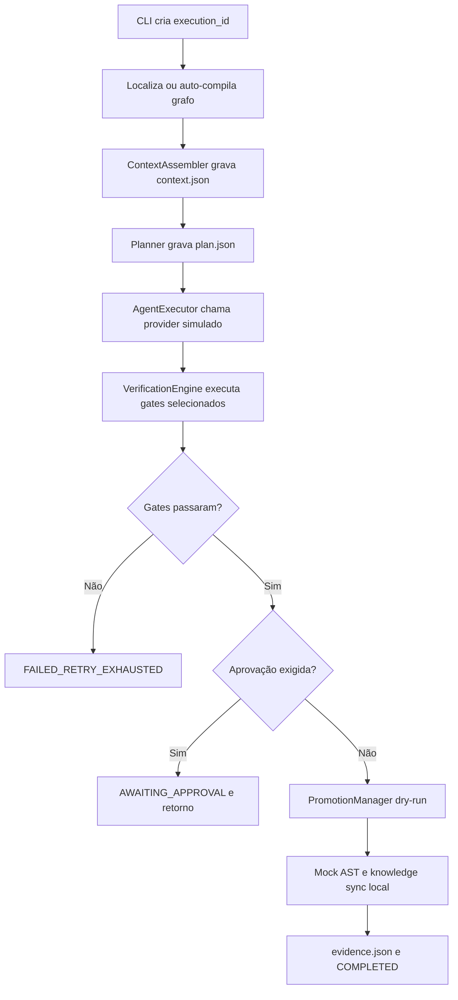

# Walkthrough da Estrutura e dos Fluxos Atuais

> **Status: mapa do protótipo em 4 de agosto de 2026**

Este walkthrough mostra a organização real do repositório e distingue o que é código executável do
que é arquitetura futura. O [dashboard HTML](walkthrough_dashboard.html) é um artefato visual
histórico e não deve ser usado como fonte de status.

## Estrutura relevante

```text
ai-engineering-harness/
├── README.md
├── TASK.md
├── pyproject.toml
├── uv.lock
├── compiler/
│   ├── compile.py
│   └── validators/
├── docs/
├── src/ai_engineering_harness/
│   ├── cli/
│   ├── compiler/
│   ├── contracts/
│   ├── defaults/
│   │   ├── agents/
│   │   ├── graphs/
│   │   ├── policies/
│   │   └── tools/
│   ├── doctor/
│   ├── governance/
│   ├── indexer/
│   ├── models/
│   ├── observability/
│   ├── runtime/
│   ├── security/
│   ├── tools/
│   ├── verification/
│   └── workspace/
└── tests/
    ├── e2e/
    ├── fixtures/
    └── unit/
```

Não existem os diretórios autorais de raiz `contracts/` ou `policies/`. Os contratos e defaults
canônicos atuais ficam dentro do pacote. Especificações padrão de grafo ficam em
`src/ai_engineering_harness/defaults/graphs/`; `.harness/graphs/specs/` é criado no repositório
de destino por `harness init`.

## Fluxo de `harness init`

1. usa o diretório atual como raiz;
2. cria a árvore `.harness/`;
3. copia defaults de agents, graphs, policies e tools quando ainda não existem;
4. cria `.harness/project.yaml` com defaults Python/pytest.

Esse scaffold é um efeito real. Ainda faltam validação do repositório, migração transacional,
manifesto de versão e rollback de inicialização previstos na F7.

## Fluxo de `harness run`



Limitações importantes:

- o runtime carrega o artefato, mas não percorre nós/arestas como contrato único de execução;
- o modelo não produz patch real;
- o `ToolRouter` não é chamado pelo caminho normal para editar a história;
- gate vazio pode ser considerado aprovado;
- promoção, indexação e parte da evidência são sintéticas;
- não existe worktree Git na sequência.

## Fluxo de verificação

O `VerificationEngine` possui runners que executam processos reais e normalizam resultados. No
runtime atual, os gates ativos vêm de política local; um diretório sem marcador de projeto recebe
lista vazia. A F4 deverá transformar gate obrigatório ausente em erro e cobrir a matriz de linguagens
com comandos configurados, timeouts e redaction.

## Fluxo de auditoria e rollback

O diário append-only e sua hash chain são implementações locais testadas. O rollback registra eventos
e pode chamar `git revert`, mas não possui o worktree/candidate commit do contrato final e o adapter
Git usa o terminal baseado em string. Portanto, o fluxo serve para testes do protocolo, não para
recuperação confiável de um produto.

## Onde acompanhar

- [TASK.md](../TASK.md): primeira tarefa pendente e checkpoints;
- [Plano operacional](plano_implementacao_harness_operacional.md): dependências e critérios concretos;
- [Auditoria do ciclo](agentic_lifecycle_audit.md): classificação por etapa.
