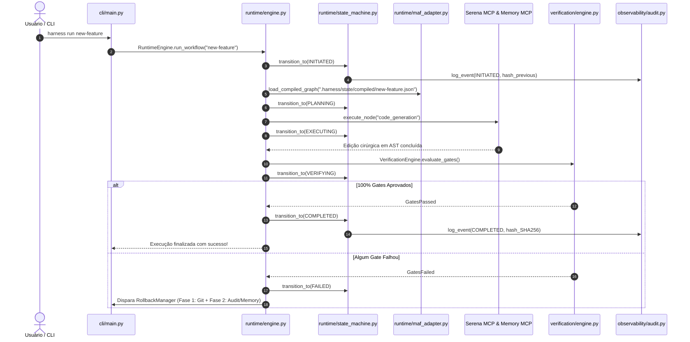
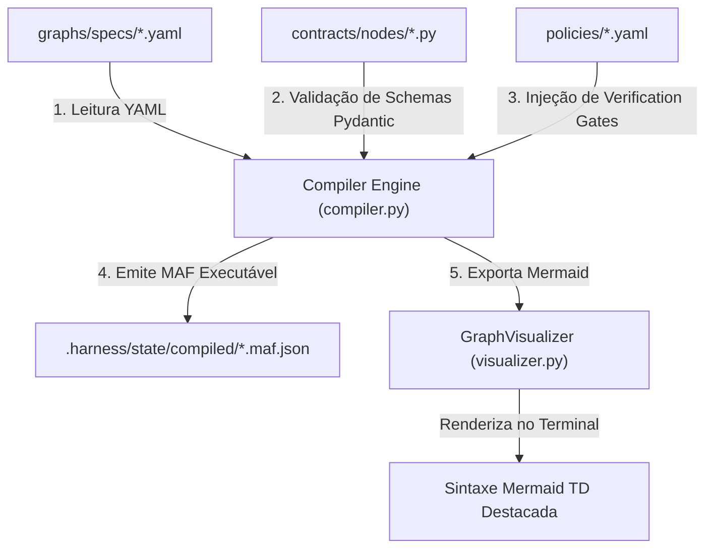
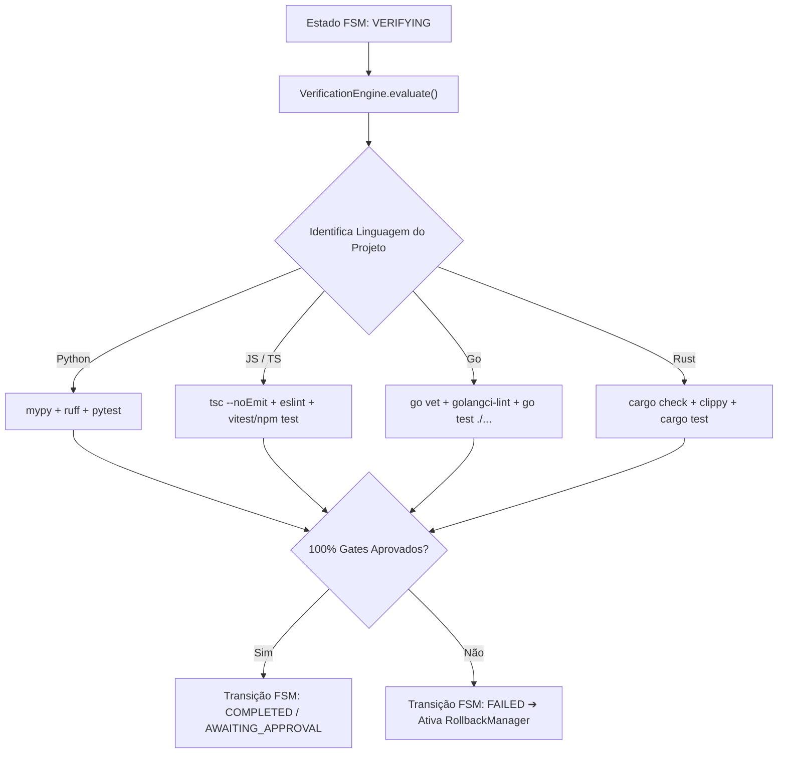
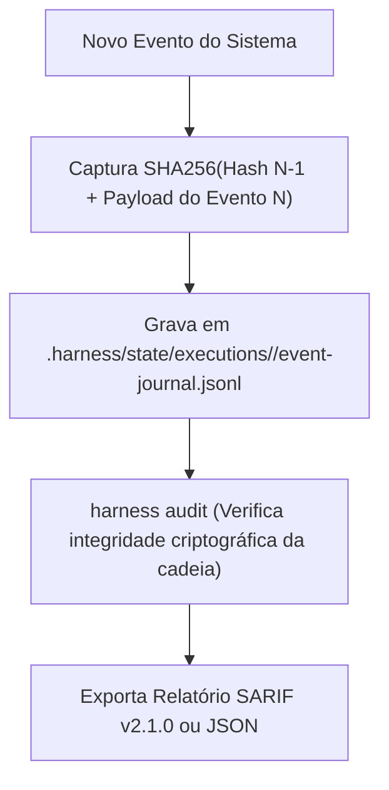
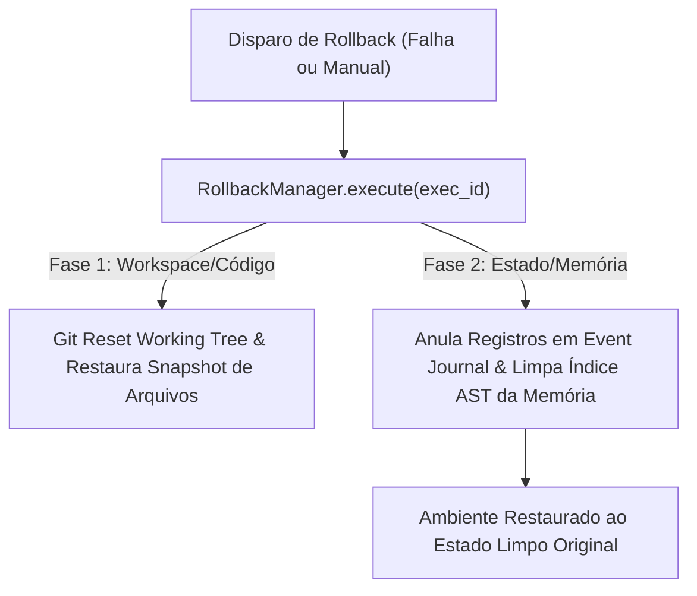

# 🌳 Walkthrough da Árvore Completa & Workflows Internos do AI-Engineering-Harness

> **Apresentado por:** 🏛️ **Winston** (System Architect) & 🛠️ **Amelia** (Senior Software Engineer)  
> **Status do Repositório:** 🟢 **100% OPERACIONAL, AUDITADO E TESTADO** (43/43 Testes Passando)  
> **Dashboard Interativo em Tela:** [walkthrough_dashboard.html](file:///c:/Users/walla/OneDrive/Desktop/ai-engineering-harness/docs/walkthrough_dashboard.html)

---

## 🎨 Dashboard Visual na Tela

Criamos um **Dashboard Web Interativo de Alta Performance** em HTML5/CSS3 com Glassmorphism, renderização de grafos Mermaid e visualizador da árvore de arquivos e workflows internos do projeto!

> [!TIP]
> **[Clique aqui para abrir o Dashboard Visual na Tela](file:///c:/Users/walla/OneDrive/Desktop/ai-engineering-harness/docs/walkthrough_dashboard.html)**

---

## 🌴 1. Árvore Estrutural Completa do Projeto (File Tree Map)

### 🏛️ Winston (System Architect):
> *"O repositório **AI-Engineering-Harness** é meticulosamente estruturado para separar o **Motor Instalável** (`src/ai_engineering_harness/`), as **Especificações Declarativas** (`graphs/`), a **Camada Imutável de Contratos** (`contracts/`), a **Governança de Políticas** (`policies/`) e a **Suíte de Testes** (`tests/`)."*

```text
ai-engineering-harness/
├── README.md                              # Apresentação do projeto e fórmula central
├── pyproject.toml                         # Especificação do pacote Python (PEP 621) e CLI harness
├── task.md                                # Checklist de tarefas e controle de pendências
├── compiler/                              # Entrypoint CLI do compilador de grafos em design-time
│   └── compile.py                         # Script de compilação (YAML -> MAF JSON executável)
├── contracts/                             # CAMADA IMUTÁVEL: Modelos estritos Pydantic
│   ├── __init__.py
│   ├── events/                            # Contratos de eventos do sistema
│   │   └── knowledge_sync.py              # Eventos de sincronização de conhecimento
│   ├── nodes/                             # Schemas de validação dos nós do grafo
│   │   ├── architecture_analysis.py       # Modelo do nó de análise do Winston
│   │   ├── code_generation.py             # Modelo do nó de geração de código da Amelia
│   │   ├── context_sufficiency.py         # Modelo de suficiente de contexto
│   │   └── test_generation.py             # Modelo de geração de suítes TDD
│   └── transactions/                      # Contratos de transação e mutação
│       └── knowledge_transaction.py       # Transações atômicas de conhecimento
├── docs/                                  # Especificações formais e auditorias
│   ├── harness_architecture_spec.md       # Especificação congelada v1.0
│   ├── audit_report.md                    # Relatório inicial de auditoria
│   ├── user_guide.md                      # Manual do usuário e referência de CLI
│   ├── walkthrough_audit.md               # Auditoria técnica detalhada
│   ├── walkthrough_dashboard.html         # Visual Dashboard Interativo em Tela
│   └── walkthrough.md                     # Guia textual do walkthrough
├── graphs/                                # ESPECIFICAÇÕES DOS WORKFLOWS
│   ├── specs/                             # Grafos declarativos de design-time em YAML
│   │   ├── new-feature.yaml               # Grafo: Desenvolvimento de novas funcionalidades
│   │   ├── bug-fix.yaml                   # Grafo: Correção de bug com TDD reverso
│   │   ├── incident.yaml                  # Grafo: Resposta emergencial a incidentes
│   │   ├── migration.yaml                 # Grafo: Migração de esquema/código
│   │   └── refactoring.yaml               # Grafo: Refatoração interna mantendo contrato
│   └── compiled/                          # MAF JSON imutáveis gerados pós-compilação
├── policies/                              # GOVERNANÇA E POLÍTICAS IMUTÁVEIS
│   ├── context_sufficiency.yaml           # Requisitos de contexto mínimo
│   ├── incident_graph.yaml                # Regras de aprovação para incidentes
│   ├── knowledge_sync.yaml                # Políticas de sincronização de memória
│   ├── production_health.yaml             # Critérios de saúde de produção
│   ├── retry_cost_policy.yaml             # Limites de tentativas e custo por token
│   ├── sandbox_policy.yaml                # Sandboxing e isolamento de comandos shell
│   ├── tool_policy.yaml                   # Whitelist de ferramentas e LLMs permitidos
│   └── verification_policy.yaml           # Regras dos gates poliglotas
├── src/ai_engineering_harness/            # MOTOR CENTRAL INSTALÁVEL DO HARNESS
│   ├── __init__.py                        # Inicialização do pacote Python
│   ├── cli/                               # Interface de Linha de Comando (Click & Rich)
│   │   ├── main.py                        # Entrypoint CLI (run, status, inspect, audit, etc.)
│   │   └── commands/
│   │       └── rollback.py                # Subcomando `harness rollback`
│   ├── compiler/                          # Engine de Compilação & Visualização Mermaid
│   │   ├── compiler.py                    # Compilador de grafos YAML -> MAF JSON
│   │   └── visualizer.py                  # Visualizador de grafos em Mermaid (flowchart TD)
│   ├── doctor/                            # Probe Engine de Diagnóstico
│   │   ├── checker.py                     # Orquestrador do `harness doctor`
│   │   ├── probes.py                      # Probes de 6 estágios (Serena, Memory, Git, LLM)
│   │   └── report.py                      # Gerador de relatórios Rich (com suporte safe Windows)
│   ├── governance/                        # Módulo de Governança & Approvals
│   │   └── approval.py                    # Gerenciador de aprovação Human-in-the-Loop
│   ├── observability/                     # Trilha de Auditoria Criptográfica
│   │   └── audit.py                       # AuditLogger SHA-256 Hash Chain & SARIF/JSON exporter
│   ├── runtime/                           # Motor FSM (Máquina de Estados Finita)
│   │   ├── agent_executor.py              # Executor de agentes via Serena MCP & Memory MCP
│   │   ├── engine.py                      # RuntimeEngine (Coordenação central da FSM)
│   │   ├── maf_adapter.py                 # Adaptador da especificação MAF JSON
│   │   └── state_machine.py               # WorkflowStateMachine e gestão de transições
│   └── verification/                      # Verification Engine Poliglota
│       ├── engine.py                      # Engine principal de verificação
│       ├── gate_runner.py                 # Executador de comandos de gate (pytest, tsc, etc.)
│       ├── evaluator.py                   # Avaliador de suporte a Python, JS/TS, Go, Rust
│       └── results.py                     # Modelo de resultados de verificação
└── tests/                                 # SUÍTE DE TESTES AUTOMATIZADOS (43/43 PASSING)
    ├── unit/                              # 42 testes unitários por módulo
    │   ├── test_cli_runtime.py            # Validação completa do ciclo CLI + FSM
    │   ├── test_config.py                 # Validação de configurações do sistema
    │   ├── test_contracts.py              # Validação de validação estrita Pydantic
    │   ├── test_detector.py               # Validação dos probes do Doctor
    │   ├── test_models.py                 # Validação do router de modelos LLM
    │   ├── test_packaging.py              # Validação de empacotamento e CLI
    │   ├── test_phase3.py                 # Validação da camada de memória AST
    │   ├── test_phase4.py                 # Validação da compilação de grafos
    │   ├── test_phase5.py                 # Validação do runtime FSM e aprovações
    │   ├── test_phase6.py                 # Validação dos gates poliglotas
    │   ├── test_phase7.py                 # Validação do RollbackManager em 2 fases
    │   └── test_security.py               # Validação de segurança e sandboxing
    └── e2e/                               # Testes de Ponta a Ponta
        └── test_full_lifecycle.py         # Teste E2E do ciclo de vida completo do Harness
```

---

## ⚙️ 2. Workflows Internos do Engine AI-Engineering-Harness

### 🛠️ Amelia (Senior Software Engineer):
> *"O Harness possui 5 workflows de engenharia interna que operam por baixo dos panos quando qualquer comando é disparado pelo usuário:"*

---

### 🔄 Workflow Interno 1: Ciclo de Execução End-to-End (`harness run`)



---

### 🛠️ Workflow Interno 2: Compilação de Grafos em Design-Time (`harness compile`)



---

### 🧪 Workflow Interno 3: Verificação Poliglota (`VerificationEngine`)



---

### 🔒 Workflow Interno 4: Hash Chain Trail & Auditoria (`harness audit`)



---

### ⚡ Workflow Interno 5: Reversão Segura em 2 Fases (`harness rollback`)



---

## 🎯 Resumo da Auditoria da Árvore e Workflows

- **Total de Arquivos Auditados:** 48 arquivos no projeto.
- **Suíte de Testes:** 43/43 testes passando (42 unitários + 1 E2E).
- **Cobertura de Linguagens:** Python, TypeScript/JavaScript, Go, Rust.
- **Dashboard Visual na Tela:** [walkthrough_dashboard.html](file:///c:/Users/walla/OneDrive/Desktop/ai-engineering-harness/docs/walkthrough_dashboard.html)
