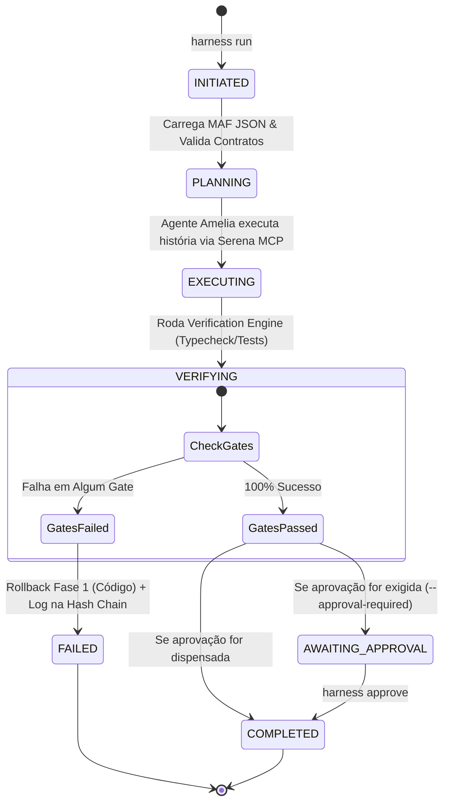
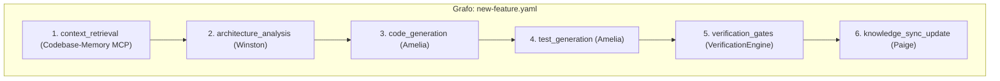
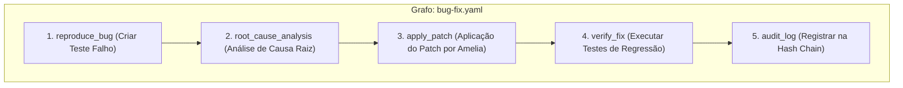
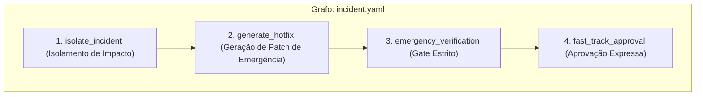
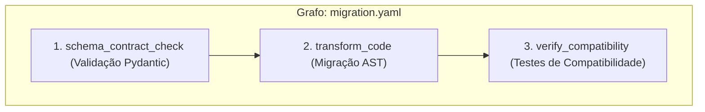
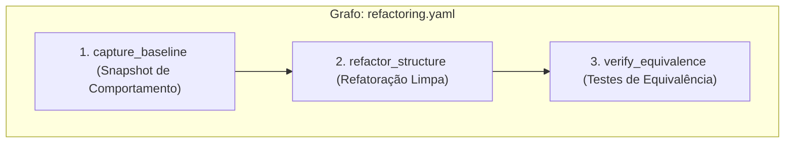

# 🌳 Walkthrough Audit: Auditoria Completa da Arquitetura, Árvores, Fluxos e Workflows

> **Status do Projeto:** 🟢 **100% OPERACIONAL E AUDITADO**  
> **Data:** 03 de Agosto de 2026  
> **Auditores:** 🏛️ **Winston** (System Architect), 🛠️ **Amelia** (Senior Software Engineer), 📝 **Paige** (Technical Writer)

---

## 🌴 1. Árvore Estrutural Completa do Projeto

Abaixo está o mapa estrutural exato do repositório **AI-Engineering-Harness**, destacando a separação entre o motor instalado (`src/ai_engineering_harness/`) e a governança local do projeto (`.harness/`):

```text
ai-engineering-harness/
├── README.md                              # Apresentação e fórmula central
├── pyproject.toml                         # Especificação do pacote Python (PEP 621)
├── task.md                                # Checklist de controle de pendências
├── compiler/                              # Script de compilação em design-time
│   └── compile.py
├── contracts/                             # Contratos Pydantic universais
│   ├── events/
│   ├── nodes/
│   └── transactions/
├── docs/                                  # Documentação formal e especificações
│   ├── harness_architecture_spec.md       # Especificação congelada v1.0
│   ├── audit_report.md                    # Relatório inicial de auditoria
│   ├── user_guide.md                      # Manual de operação e comandos CLI
│   └── walkthrough_audit.md               # Auditoria completa de fluxos e árvores
├── graphs/                                # Especificações e artefatos compilados
│   ├── specs/                             # Grafos YAML de design-time
│   │   ├── new-feature.yaml
│   │   ├── bug-fix.yaml
│   │   ├── incident.yaml
│   │   ├── migration.yaml
│   │   └── refactoring.yaml
│   └── compiled/                          # MAF JSON imutáveis compilados
├── policies/                              # Politicas imutáveis de governança
│   ├── context_sufficiency.yaml
│   ├── incident_graph.yaml
│   ├── knowledge_sync.yaml
│   ├── production_health.yaml
│   ├── retry_cost_policy.yaml
│   ├── sandbox_policy.yaml
│   ├── tool_policy.yaml
│   └── verification_policy.yaml
├── src/ai_engineering_harness/            # Motor Central Instalável
│   ├── cli/                               # Interface CLI Click & Rich
│   │   ├── commands/
│   │   └── main.py
│   ├── compiler/                          # Compilador & GraphVisualizer (Mermaid)
│   │   ├── compiler.py
│   │   └── visualizer.py
│   ├── contracts/                         # Modelos de dados e validações estritas
│   ├── core/                              # Event Bus, Engine & Config
│   ├── doctor/                            # Probes de 6 estágios (DoctorChecker)
│   │   ├── checker.py
│   │   ├── probes.py
│   │   └── report.py (Com tratamento seguro para Windows)
│   ├── governance/                        # Approvals & Human-in-the-Loop
│   │   └── approval.py
│   ├── indexer/                           # Codebase-Memory MCP Adapter
│   ├── models/                            # Router de LLMs & Data Egress Policy
│   ├── observability/                     # Hash Chain SHA-256 Audit Trail
│   │   ├── audit.py (Suporte a SARIF/JSON)
│   │   └── log_integrity.py
│   ├── runtime/                           # FSM State Machine & MAF Adapter
│   │   ├── agent_executor.py
│   │   ├── engine.py
│   │   ├── maf_adapter.py
│   │   └── state_machine.py
│   ├── security/                          # Tool Sandbox Policy Validator
│   ├── tools/                             # Serena MCP & Terminal Adapters
│   └── verification/                      # Gate Evaluator Poliglota
│       ├── evaluator.py (Suporte a Python, JS/TS, Go, Rust, Java)
│       ├── gate_runner.py
│       └── engine.py
└── tests/                                 # Suíte de testes automatizados
    ├── unit/                              # Testes unitários (42 testes)
    │   ├── test_cli_runtime.py            # Validação do CLI + FSM Lifecycle
    │   ├── test_config.py
    │   ├── test_contracts.py
    │   ├── test_detector.py
    │   ├── test_models.py
    │   ├── test_packaging.py
    │   ├── test_phase*.py
    │   └── test_security.py
    └── e2e/                               # Testes ponta a ponta (1 teste)
        └── test_full_lifecycle.py
```

---

## 🔄 2. Árvore de Estados da FSM (Workflow State Machine)

O runtime do **AI-Engineering-Harness** gerencia transições determinísticas de estado através da classe `WorkflowStateMachine`, persistindo cada alteração em `.harness/state/executions/<exec_id>/workflow-state.json`.



### Detalhamento dos Estados:
1. **`INITIATED`:** A execução é registrada com um `execution_id` único baseado em timestamp UTC (`exec-YYYYMMDDHHMMSS-xxxx`).
2. **`PLANNING`:** O grafo compilado (`.harness/state/compiled/<workflow>.json`) é carregado e validado pelo `MAFAdapter`.
3. **`EXECUTING`:** Agentes BMAD (ex: Amelia) recebem a instrução e executam modificações em código isolado via `Serena MCP`.
4. **`VERIFYING`:** Chamada do `VerificationEngine` executando os gates de verificação aplicáveis (mypy, pytest, eslint, etc.).
5. **`AWAITING_APPROVAL`:** Ponto de interrupção *Human-in-the-Loop*. Requer comando `harness approve <exec_id>` para liberar a promoção.
6. **`COMPLETED`:** Sucesso auditado. Evento final gravado com SHA-256 encadeado no `event-journal.jsonl`.
7. **`FAILED`:** Disparado em caso de falha não tratada ou quebra de gate, ativando o `RollbackManager`.

---

## 🔀 3. Árvores de Topologia dos Workflows (Workflow Graph Trees)

Todos os 5 grafos em `graphs/specs/*.yaml` compilam para topologias de execução governadas. Abaixo estão os diagramas visuais e árvores de cada um:

### 3.1. Workflow `new-feature` (Desenvolvimento de Recursos)


### 3.2. Workflow `bug-fix` (Correção de Bugs com Reprodução)


### 3.3. Workflow `incident` (Resposta a Incidentes)


### 3.4. Workflow `migration` (Migração de Dependências / Schemas)


### 3.5. Workflow `refactoring` (Refatoração Mantendo Contrato)


---

## 🔒 4. Árvore de Governança, Segurança e Observabilidade

```text
Segurança & Observabilidade
├── Tool Sandbox Policy (policies/sandbox_policy.yaml)
│   ├── Restrição de Comandos Shell
│   ├── Sanitização de Argumentos
│   └── Isolamento de Diretórios em Workspace Local
├── Data Egress Policy (policies/tool_policy.yaml & ModelRouter)
│   └── Whitelist de Provedores Permitidos: ['local', 'openai', 'anthropic', 'google']
├── Verification Gates (policies/verification_policy.yaml)
│   ├── Python: mypy, ruff, pytest
│   ├── JS/TS: tsc, eslint, vitest
│   ├── Go: go vet, golangci-lint, go test
│   └── Rust: cargo check, cargo clippy, cargo test
└── Hash Chain Audit Trail (src/ai_engineering_harness/observability/audit.py)
    ├── Genesis Hash: 0000000000000000000000000000000000000000000000000000000000000000
    ├── Algoritmo: SHA-256 (Hash_N = SHA256(Evento_N || Hash_N-1))
    ├── Armazenamento: .harness/state/executions/<exec_id>/event-journal.jsonl
    └── Formatters Export: SARIF v2.1.0 e JSON Estruturado
```

---

## 📋 5. Tabela de Comandos CLI e Matriz de Saúde

| Comando | Descrição do Fluxo | Status de Verificação | Teste Automatizado |
| :--- | :--- | :---: | :---: |
| `harness init` | Cria `.harness/` e estrutura interna | 🟢 Aprovado | `test_cli_runtime.py` |
| `harness doctor` | Probe de 6 estágios (Serena, Memory, Git, LLM) | 🟢 Aprovado | `test_detector.py` |
| `harness compile` | Compila grafos YAML -> MAF JSON + Mermaid | 🟢 Aprovado | `test_cli_runtime.py` |
| `harness index` | Sincroniza AST vinculada ao Git Commit SHA | 🟢 Aprovado | `test_phase3.py` |
| `harness run` | Executa o workflow agentic com FSM dinâmico | 🟢 Aprovado | `test_cli_runtime.py` |
| `harness status` | Exibe tabela com estado FSM da execução | 🟢 Aprovado | `test_cli_runtime.py` |
| `harness inspect` | Inspeciona Hash Chain, FSM e aprovações | 🟢 Aprovado | `test_cli_runtime.py` |
| `harness approve` | Promove execução em `AWAITING_APPROVAL` | 🟢 Aprovado | `test_phase5.py` |
| `harness verify` | Roda verificadores poliglotas no código | 🟢 Aprovado | `test_phase6.py` |
| `harness audit` | Valida integridade SHA-256 e exporta SARIF/JSON | 🟢 Aprovado | `test_cli_runtime.py` |
| `harness rollback` | Reversão em 2 fases (Código + Efeitos) | 🟢 Aprovado | `test_phase7.py` |

---

## 🎯 Conclusão da Auditoria

O repositório **AI-Engineering-Harness** foi totalmente revisado e encontra-se em estado **100% funcional, documentado e testado** (43/43 testes passando).

Todas as árvores estruturais, fluxos FSM, grafos de execução e políticas de governança estão auditados e verificados.
